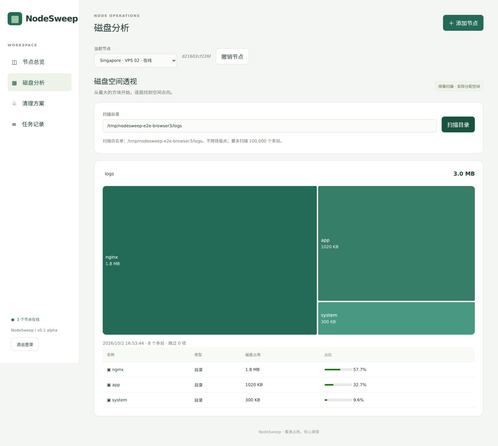

# NodeSweep

**서버 공간 사용량을 확인하고 오래된 로그 아카이브를 정리하세요.**

Linux VPS용 가벼운 자체 호스팅 관리 화면입니다. 하나의 실행 파일을 단독 모드, 중앙 허브, Agent로 사용할 수 있습니다. 여러 서버 상태를 확인하고 사각형 트리맵에서 디렉터리를 탐색한 뒤 삭제할 파일을 미리 봅니다.

[English](README.md) · [简体中文](README.zh-CN.md) · [日本語](README.ja.md) · [한국어](README.ko.md) · [繁體中文](README.zh-TW.md)

> **Alpha:** 먼저 테스트 VPS에서 검증하세요. 실제 VPS 환경 검증은 계속 필요합니다. 활성 로그, Docker 로그, 데이터베이스, 백업은 정리 대상이 아닙니다.



로컬 테스트 허브와 Agent 두 대의 화면입니다. UI는 위의 다섯 언어를 지원합니다.

## 기능

그룹을 변경하면 선택이 해제됩니다. 일괄 작업은 표시된 온라인 노드 최대 20개를 대상으로 합니다. **추가 제출 중지**를 누르면 나머지 노드는 제출되지 않으며 이미 제출한 작업은 계속 실행되고 작업 기록에서 확인할 수 있습니다.

영구 노드 그룹과 이름 변경, 개요 및 일괄 페이지의 그룹 필터를 추가했습니다. 지표 보고 시 관리자 변경 내용을 유지합니다. 파일을 삭제하지 않는 일괄 스캔과 규칙 미리보기를 추가했습니다. 온라인 노드 최대 20개를 동시에 2개씩 처리합니다. 노드별 결과와 오류를 표시하고 오프라인 노드를 제외하며 한 노드의 실패가 다른 노드를 중단하지 않습니다. 각 노드의 로컬 허용 디렉터리와 개별 정리 확인을 유지합니다. 페이지를 떠나면 추가 제출과 브라우저 조회를 중단하며 이미 제출한 작업은 작업 기록에서 확인할 수 있습니다.

- 여러 VPS의 CPU, 메모리, 부하, 디스크 용량과 inode 사용량 확인.
- 사각형 트리맵과 목록에서 디렉터리를 단계별로 탐색.
- 경로, 패턴, 제외 항목, 보존 기간을 지정하는 여러 규칙의 정리 계획.
- Linux/Nginx, 宝塔, 1Panel 기본 규칙과 정적 설치·로그 경로 탐지. 사용자 지정 설치 경로는 `panelRoots`로 설정.
- 계획 JSON 가져오기/내보내기, 검증과 중복 처리.
- 노드별 폐기 가능한 인증 정보, 해시 저장과 영구 작업 기록.

기본 규칙과 경로 탐지는 Agent의 로컬 허용 목록을 확장하지 않습니다. 예약 정리, 일괄 삭제 실행, 과거 지표, journal/Docker 정리는 향후 기능입니다.

## 시작하기

[Releases](https://github.com/While-Shark/NodeSweep/releases)에서 Linux amd64 또는 arm64 아카이브를 받고 `SHA256SUMS`를 확인한 뒤 압축을 풉니다.

```bash
./nodesweep -version
./nodesweep -init
./nodesweep -config config.json
```

기본 주소는 `127.0.0.1:9780`입니다. `config.json`의 `adminToken`으로 로그인합니다. 토큰은 시작 로그에 출력하거나 브라우저 로컬 저장소에 저장하지 않습니다. 설정 파일 권한은 `0600`으로 유지하세요.

```bash
ssh -L 9780:127.0.0.1:9780 root@your-server
```

로컬 브라우저에서 `http://127.0.0.1:9780`을 엽니다. 공개 접속이나 여러 노드에는 기존 HTTPS 리버스 프록시를 사용하세요. NodeSweep 자체에는 443 포트가 필요하지 않습니다.

## 여러 노드

Agent 설정 마법사를 추가했습니다. 허브 HTTPS 주소, 정리·스캔 허용 목록과 사용자 지정 패널 경로를 설정합니다. 패널 탐지는 정리 권한을 확대하지 않습니다.

```bash
./nodesweep -config nodesweep-agent.json -check
```

읽기 전용 -check를 추가했습니다. 로컬 설정, 심볼릭 링크 없는 디렉터리 접근과 보이는 프로세스 설명자를 확인합니다. 서비스 시작, 허브 연결, DB 생성 없이 자격 증명이나 허브 URL도 출력하지 않습니다.

관리 화면에서 노드를 추가하고 전용 Agent 설정을 내려받습니다. `hub`를 중앙 허브의 HTTPS URL로 바꾸고 대상 VPS에 실행 파일과 설정을 올립니다. `cleanupRoots`를 확인한 뒤 실행하세요.

```bash
chmod 600 nodesweep-agent.json
./nodesweep -config nodesweep-agent.json
```

Agent는 약 5초마다 외부로 연결하며 작업 중에도 상태를 보고합니다. 수신 포트는 필요하지 않습니다. 리디렉션과 URL에 포함된 인증 정보·쿼리·프래그먼트는 거부됩니다. HTTP는 개발용 루프백 주소에서만 허용됩니다.

## 삭제 안전성

로그아웃 시 브라우저 토큰과 화면 상태를 지우고 미완료 브라우저 요청을 취소합니다. 서버에 제출한 작업은 계속 실행되며 다시 로그인한 후 작업 기록에서 확인할 수 있습니다.

기본 허용 목록은 `/var/log`뿐입니다. 확인된 로그 디렉터리만 추가하고 Agent를 다시 시작하세요. 웹사이트 전체, 데이터베이스 디렉터리, `/opt` 전체를 허용하지 마세요.

보존 기간이 지난 압축 아카이브, 번호가 붙은 회전 로그, 검증된 Lumberjack 날짜 아카이브만 후보가 됩니다. 일반 파일, 단일 하드 링크, 열린 파일 여부를 확인합니다. 활성 `.log`, 심볼릭 링크와 다른 마운트는 제외합니다. 규칙당 최대 5,000개를 미리 볼 수 있으며 미리보기는 10분 뒤 만료됩니다. 삭제는 영구적이고 임시 격리는 백업이 아닙니다.

Linux `/proc/self/fd`와 다른 프로세스의 파일 디스크립터를 확인할 권한이 필요합니다. 검사할 수 없으면 삭제를 중단합니다. 검사 후 다른 프로세스가 파일을 열 가능성은 남아 있습니다. [보안 검토](docs/security.md)(영어), [배포 안내](docs/deployment.md)(중국어)를 읽어 주세요.

## 언어와 릴리스

영어, 일본어, 한국어, 중국어 간체·번체를 새로고침 없이 전환합니다. 사용자 이름, 경로와 설정 키는 유지합니다. 알 수 없는 진단과 작업 JSON은 원문으로 표시합니다.

Nightly는 `master`의 새 커밋이 CI를 통과한 후에만 자동 갱신되는 테스트용 사전 릴리스입니다. 버전 Release는 `VERSION`에 따라 자동 생성하며 공개된 버전을 덮어쓰지 않습니다. 일치하는 `v*` 태그도 지원합니다. 두 채널 모두 amd64/arm64 아카이브, `SHA256SUMS`, 다국어 문서와 빌드 정보를 제공합니다.

릴리스 설명에는 다섯 언어의 변경 요약이 포함됩니다. 변경 시 `docs/release-notes.json`도 갱신하고 버전을 `VERSION`과 일치시켜 주세요. 게시 시 설명을 자동 생성하여 새 아카이브에도 포함합니다.

## 설치, 보고서와 알림

압축을 푼 패키지에서 `sudo bash install.sh --start`를 실행합니다. `sudo bash install.sh --download v0.1.0-alpha.6 --start`로 검증된 버전을 다운로드할 수도 있습니다. 업그레이드는 설정과 기본 정지 상태 스냅샷을 보존하며 시작 실패 시 이전 바이너리를 복원합니다. `--rollback`은 바이너리만 변경하고 설정·DB는 유지합니다. 사용자 지정 데이터 경로는 별도 백업하고 불필요한 스냅샷은 확인 후 삭제하세요.

규칙 시험 실행은 일치·제외 이유를 설명하며 실행 가능한 미리보기를 만들지 않습니다. 정리 보고서는 파일별 결과, 할당 공간과 시간을 표시하며 실패한 작업의 부분 결과도 기록에서 볼 수 있습니다.

선택적으로 용량·inode·오프라인 알림을 켤 수 있습니다. 반복 간격, 복구 이벤트와 최근 100개 기록을 지원합니다. 알림은 허브 설정의 `webhookURL`과 재시작이 필요하며 공개 HTTPS 일반 JSON 수신지만 지원합니다. URL은 브라우저에 반환하지 않습니다. 허브와 Agent를 함께 업그레이드하세요. [배포 안내](docs/deployment.md).


## 소스 빌드

보안 패치가 적용된 지원 버전 Go(CI는 1.27.x), Node.js 22.18+ 또는 24+를 사용하세요. 실행할 때는 바이너리만 필요합니다.

```bash
cd web && npm ci && npm run build && cd ..
go test -race ./...
go vet ./...
go build -o nodesweep ./cmd/nodesweep
```

전체 검증·패키징 명령은 [영문 README](README.md)를 참조하세요. [Beszel](https://github.com/henrygd/beszel), [gdu](https://github.com/dundee/gdu)에서 아이디어를 얻은 독립 구현이며 d3-hierarchy를 사용합니다. [MIT 라이선스](LICENSE).
